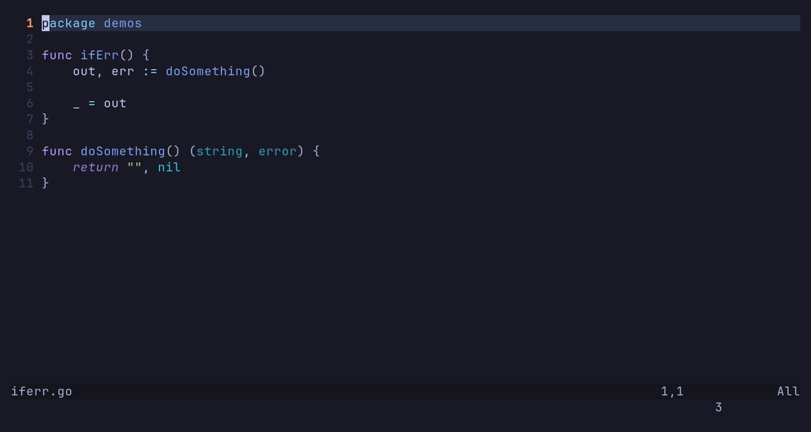

# gopher.nvim

[](https://stand-with-ukraine.pp.ua)

Minimalistic plugin for Go development in Neovim written in Lua.

It's **NOT** an LSP tool, the main goal of this plugin is to add go tooling support in Neovim.

> If you want to use new and maybe undocumented, and unstable features you might use [develop](https://github.com/olexsmir/gopher.nvim/tree/develop) branch.

## Install (using [lazy.nvim](https://github.com/folke/lazy.nvim))

Requirements:

- **Neovim 0.10** or later
- Treesitter `go` parser(`:TSInstall go` if you use [nvim-treesitter](https://github.com/nvim-treesitter/nvim-treesitter))
- [Go](https://github.com/golang/go) installed (tested on 1.23)

```lua
-- NOTE: this plugin is already lazy-loaded, it adds only about 1ms of load
-- time to your config
{
  "olexsmir/gopher.nvim",
  ft = "go",
  -- branch = "develop"
  -- (optional) will update plugin's deps on every update
  build = function()
    vim.cmd.GoInstallDeps()
  end,
  ---@module "gopher"
  ---@type gopher.Config
  opts = {},
}
```

## Features

<details>
  <summary>
    <b>Install plugin's go deps</b>
  </summary>

  ```vim
  :GoInstallDeps
  ```

  This will install the following tools:

  - [gomodifytags](https://github.com/fatih/gomodifytags)
  - [impl](https://github.com/josharian/impl)
  - [gotests](https://github.com/cweill/gotests)
  - [iferr](https://github.com/koron/iferr)
</details>

<details>
  <summary>
    <b>Add and remove tags for structs via <a href="https://github.com/fatih/gomodifytags">gomodifytags</a></b>
  </summary>

  

  By default `json` tag will be added/removed, if not set:

  ```vim
  " add json tag
  :GoTagAdd json

  " remove yaml tag
  :GoTagRm yaml
  ```

  ```lua
  -- or you can use lua api
  require("gopher").tags.add "xml"
  require("gopher").tags.rm "proto"
  ```
</details>

<details>
  <summary>
    <b>Generating tests via <a href="https://github.com/cweill/gotests">gotests</a></b>
  </summary>

  ```vim
  " Generate one test for a specific function/method(one under cursor)
  :GoTestAdd

  " Generate all tests for all functions/methods in the current file
  :GoTestsAll

  " Generate tests for only  exported functions/methods in the current file
  :GoTestsExp
  ```

  ```lua
  -- or you can use lua api
  require("gopher").test.add()
  require("gopher").test.exported()
  require("gopher").test.all()
  ```

  For named tests see `:h gopher.nvim-gotests-named`
</details>

<details>
  <summary>
    <b>Run commands like <code>go mod/get/etc</code> inside of nvim</b>
  </summary>

  ```vim
  :GoGet github.com/gorilla/mux

  " Link can have an `http` or `https` prefix.
  :GoGet https://github.com/lib/pq

  " You can provide more than one package url
  :GoGet github.com/jackc/pgx/v5 github.com/google/uuid/

  " go mod commands
  :GoMod tidy
  :GoMod init new-shiny-project

  " go work commands
  :GoWork sync

  " run go generate in cwd
  :GoGenerate

  " run go generate for the current file
  :GoGenerate %
  ```
</details>

<details>
  <summary>
    <b>Interface implementation via <a href="https://github.com/josharian/impl">impl<a></b>
  </summary>

  

  Syntax of the command:
  ```vim
  :GoImpl [receiver] [interface]

  " also you can put a cursor on the struct and run
  :GoImpl [interface]
  ```

  Usage examples:
  ```vim
  :GoImpl r Read io.Reader
  :GoImpl Write io.Writer

  " or you can simply put a cursor on the struct and run
  :GoImpl io.Reader
  ```
</details>

<details>
  <summary>
    <b>Generate boilerplate for doc comments</b>
  </summary>

  

  First set a cursor on **public** package/function/interface/struct and execute:

  ```vim
  :GoCmt
  ```
</details>


<details>
  <summary>
    <b>Generate <code>if err != nil {</code> via <a href="https://github.com/koron/iferr">iferr</a></b>
  </summary>

  

  Set the cursor on the line with `err` and execute

  ```vim
  :GoIfErr
  ```
</details>

## Configuration

> [!IMPORTANT]
>
> If you need more info look `:h gopher.nvim`

**Take a look at default options (might be a bit outdated, look `:h gopher.nvim-config`)**

```lua
require("gopher").setup {
  -- log level, you might consider using DEBUG or TRACE for debugging the plugin
  log_level = vim.log.levels.INFO,

  -- timeout for running internal commands
  timeout = 2000,

  commands = {
    go = "go",
    gomodifytags = "gomodifytags",
    gotests = "gotests",
    impl = "impl",
    iferr = "iferr",
  },
  gotests = {
    -- gotests doesn't have template named "default" so this plugin uses "default" to set the default template
    template = "default",
    -- path to a directory containing custom test code templates
    template_dir = nil,
    -- switch table tests from using slice to map (with test name for the key)
    named = false,
  },
  gotag = {
    transform = "snakecase",
    -- default tags to add to struct fields
    default_tag = "json",
  },
  iferr = {
    -- choose a custom error message
    message = nil,
  },
}
```

## Contributing

PRs are always welcome. See [CONTRIBUTING.md](./CONTRIBUTING.md)
