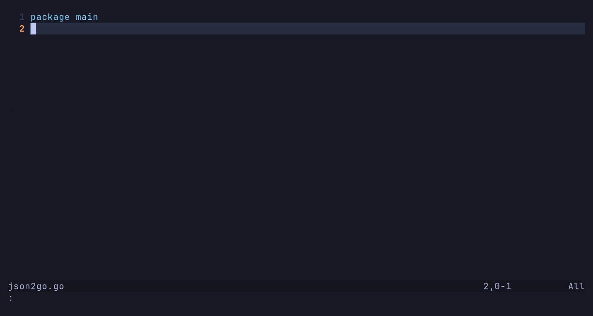
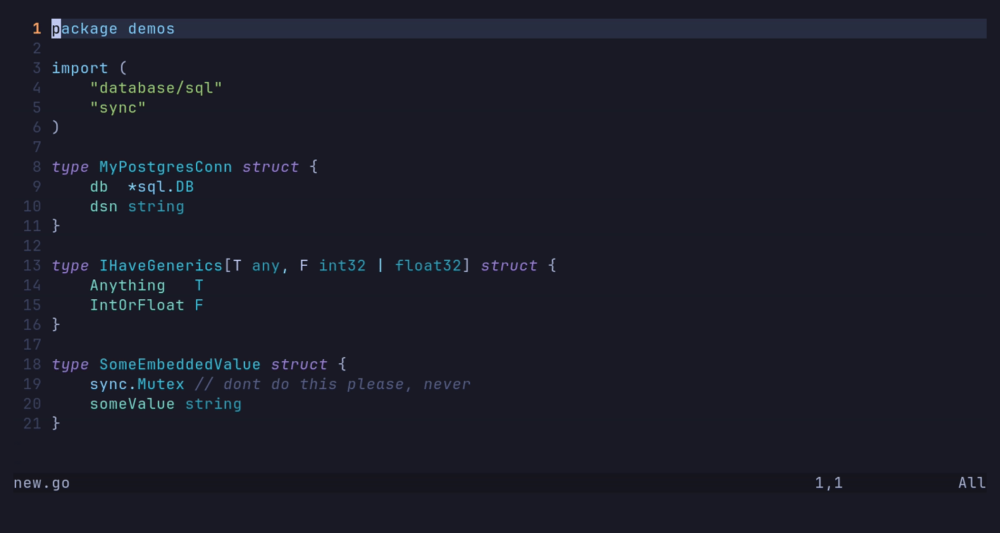
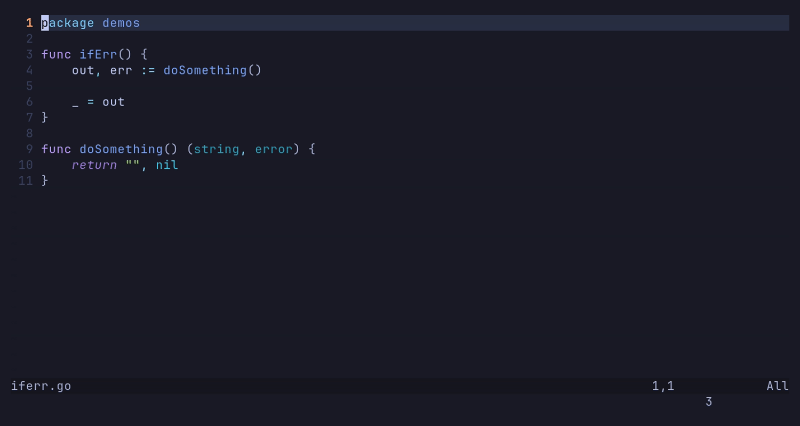

# gopher.nvim

[](https://stand-with-ukraine.pp.ua)

A minimalistic plugin for Go development in Neovim, written in Lua.

It's **NOT** an LSP tool. The goal of this plugin is to add Go tooling support in Neovim.

> All development of new -- and maybe undocumented or unstable features happens on the [develop](https://github.com/olexsmir/gopher.nvim/tree/develop) branch.

## Table of contents
* [How to install](#install)
* [Features](#features)
* [Configuration](#configuration)
* [Troubleshooting](#troubleshooting)
* [Contributing](#contributing)

## Install

Requirements:

- **Neovim 0.10** or later
- Treesitter parser for `go`(`:TSInstall go` if you use [nvim-treesitter](https://github.com/nvim-treesitter/nvim-treesitter))
- [go](https://github.com/golang/go) installed.

> [!IMPORTANT]
> If you prefer using other forges, this repository is also mirrored at:
> - [tangled.org](https://tangled.org): [`https://tangled.org/olexsmir.xyz/gopher.nvim`](https://tangled.org/did:plc:slhnamqkslwa5e5e5hrznbxr/gopher.nvim)
> - [codeberg.org](https://codeberg.org): [`https://codeberg.org/olexsmir/gopher.nvim`](https://codeberg.org/olexsmir/gopher.nvim)

```lua
vim.pack.add { "https://github.com/olexsmir/gopher.nvim" }

-- NOTE: .setup() is completely optional; only required if you want to change plugin options
require("gopher").setup {}

-- (optional) update the plugin's dependencies on updates
vim.api.nvim_create_autocmd("PackChanged", {
  pattern = "*",
  callback = function(ev)
    if ev.data.spec.name == "gopher.nvim" and vim.tbl_contains({ "install", "update" }, ev.data.kind) then
      vim.cmd.GoInstallDeps()
    end
  end
})
```

## Features

<details>
  <summary>
    <b>Install the plugin's Go dependencies</b>
  </summary>

  ```vim
  :GoInstallDeps
  ```

  This will install the following tools:

  - [gomodifytags](https://github.com/fatih/gomodifytags)
  - [impl](https://github.com/josharian/impl)
  - [gotests](https://github.com/cweill/gotests)
  - [iferr](https://github.com/koron/iferr)
  - [json2go](https://github.com/olexsmir/json2go)
</details>

<details>
  <summary>
    <b>Add and remove tags for structs via <a href="https://github.com/fatih/gomodifytags">gomodifytags</a></b>
  </summary>

  

  By default `json` tag will be added/removed, if none provided:

  ```vim
  " add json tag
  :GoTagAdd json

  " add json tag with the omitempty option
  :GoTagAdd json=omitempty

  " remove yaml tag
  :GoTagRm yaml
  ```

  ```lua
  -- or you can use lua api
  require("gopher").tags.add "xml"
  require("gopher").tags.rm "proto"
  ```
</details>

<details>
  <summary>
    <b>Generating tests via <a href="https://github.com/cweill/gotests">gotests</a></b>
  </summary>

  ```vim
  " Generate one test for a specific function/method(the one under the cursor)
  :GoTestAdd

  " Generate all tests for functions/methods in the current file
  :GoTestsAll

  " Generate tests only for exported functions/methods in the current file
  :GoTestsExp
  ```

  ```lua
  -- or you can use lua api
  require("gopher").test.add()
  require("gopher").test.exported()
  require("gopher").test.all()
  ```

  For named tests see `:h gopher.nvim-gotests-named`
</details>

<details>
  <summary>
    <b>Run commands like <code>go mod/get/etc</code> inside of nvim</b>
  </summary>

  ```vim
  :GoGet github.com/gorilla/mux

  " Links can have an `http` or `https` prefix.
  :GoGet https://github.com/lib/pq

  " You can provide more than one package url
  :GoGet github.com/jackc/pgx/v5 github.com/google/uuid/

  " go mod commands
  :GoMod tidy
  :GoMod init new-shiny-project

  " go work commands
  :GoWork sync

  " run go generate in the cwd
  :GoGenerate

  " run `go generate` for the current file
  :GoGenerate %
  ```
</details>

<details>
  <summary>
    <b>Interface implementation via <a href="https://github.com/josharian/impl">impl</a></b>
  </summary>

  

  Syntax of the command:
  ```vim
  :GoImpl [receiver] [interface]

  " you can also place the cursor on the struct and run
  :GoImpl [interface]
  ```

  Usage examples:
  ```vim
  :GoImpl r Read io.Reader
  :GoImpl Write io.Writer

  " or place the cursor on the struct and run
  :GoImpl io.Reader
  ```
</details>

<details>
  <summary>
    <b>Generate boilerplate for doc comments</b>
  </summary>

  

  Place the cursor on a **public** package, function, interface, or struct and execute:

  ```vim
  :GoCmt
  ```
</details>

<details>
  <summary>
    <b>Convert json to Go types</b>
  </summary>

  

  `:GoJson` opens a temporary buffer where you can paste or write JSON.
  Saving the buffer (`:w` or `:wq`) closes it and inserts the generated Go struct into the original buffer at the cursor position.

  Alternatively, you can pass JSON directly as an argument:
  ```vim
  :GoJson {"name": "Alice", "age": 30}
  ```

  Additionally, `gopher.json2go` provides a Lua API; see `:h gopher.nvim-json2go` for details.
</details>

<details>
  <summary>
    <b>Generate constructors for structs</b>
  </summary>

  

  Place the cursor on a struct and run:

  ```vim
  :GoNew
  ```

  This inserts a `NewTypeName(...)` constructor after the struct declaration.
  See `:h gopher.nvim-new` for details.
</details>


<details>
  <summary>
    <b>Generate <code>if err != nil {</code> via <a href="https://github.com/koron/iferr">iferr</a></b>
  </summary>

  

  Set the cursor on the line with `err` and execute

  ```vim
  :GoIfErr
  ```
</details>

## Configuration

> [!IMPORTANT]
>
> If you need more info look `:h gopher.nvim`

**Take a look at default options (might be a bit outdated, look `:h gopher.nvim-config`)**

```lua
require("gopher").setup {
  -- log level, you might consider using DEBUG or TRACE for debugging the plugin
  log_level = vim.log.levels.INFO,

  -- timeout for running internal commands
  timeout = 2000,

  -- timeout for running installer commands(e.g :GoDepsInstall, :GoDepsInstallSync)
  installer_timeout = 999999,

  -- user specified paths to binaries
  commands = {
    go = "go",
    gomodifytags = "gomodifytags",
    gotests = "gotests",
    impl = "impl",
    iferr = "iferr",
  },
  gotests = {
    -- a default template that gotess will use.
    -- gotets doesn't have template named `default`, we use it to represent absence of the provided template.
    template = "default",

    -- path to a directory containing custom test code templates
    template_dir = nil,

    -- use named tests(map with test name as key) in table tests(slice of structs by default)
    named = false,
  },
  gotag = {
    transform = "snakecase",

    -- default tags to add to struct fields
    default_tag = "json",

    -- default tag option added struct fields, set to nil to disable
    -- e.g: `option = "json=omitempty,xml=omitempty`
    option = nil,
  },
  iferr = {
    -- choose a custom error message, nil to use default
    -- e.g: `message = 'fmt.Errorf("failed to %w", err)'`
    message = nil,
  },
  json2go = {
    -- command used to open interactive input.
    -- e.g: `split`, `botright split`, `tabnew`
    interactive_cmd = "vsplit",

    -- name of autogenerated struct, if nil none, will the default one of json2go("AutoGenerated")
    -- e.g: "MySuperCoolName"
    type_name = nil,
  },
}
```

## Troubleshooting
The most common issue people have with this plugin is missing dependencies.
Run `:checkhealth gopher` to verify the plugin is installed correctly.
If any binaries are missing, install them using `:GoInstallDeps`.

If the issue persists, feel free to [open a new issue](https://github.com/olexsmir/gopher.nvim/issues/new).

## Contributing

PRs are always welcome. See [CONTRIBUTING.md](./CONTRIBUTING.md)
